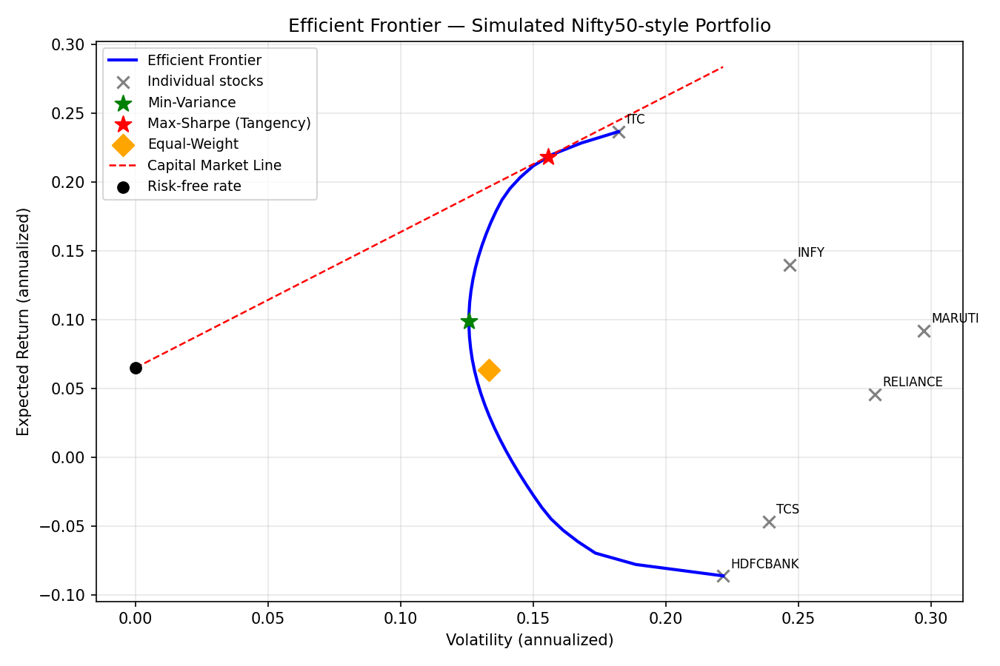

# Nifty50 Portfolio Optimization (Markowitz Mean-Variance)

A from-scratch implementation of mean-variance portfolio optimization on 12
liquid Nifty50 stocks. It builds the minimum-variance portfolio, the
max-Sharpe (tangency) portfolio, the full efficient frontier, and then
tests all of it with a rolling, multi-window backtest against a simple
equal-weight benchmark.



## What this project does

1. Pulls 6 years (2019 to 2024) of daily prices for 12 Nifty50 stocks
   across sectors: banking, IT, FMCG, energy, telecom, auto.
2. Estimates expected returns (mu) and the covariance matrix (sigma) from
   historical daily log returns, then annualizes both.
3. Solves three portfolio optimizations, all under a no-short-selling
   constraint (weights have to be zero or positive and sum to 1):
   - **Minimum-variance portfolio**: the least risky combination possible, it doesn't even look at expected returns
   - **Max-Sharpe (tangency) portfolio**: the best risk-adjusted return
   - **Efficient frontier**: the full risk/return tradeoff curve
4. Runs a rolling, expanding-window backtest. Each round, it estimates mu
   and sigma using only the data available up to that point, locks in the
   resulting weights, and tests them on the following year. Then it
   repeats, expanding the training window each time, across four separate
   windows (train 2019-2020, test 2021; all the way up to train
   2019-2023, test 2024).
5. Compares all three portfolios against equal-weight, both per window
   and averaged across all of them.

## Key result

A single train/test split can be misleading. I checked that on purpose,
and it turned out to matter a lot.

The first version of this project used one 70/30 split (train on the
first 70% of the data, test on the rest), and Max-Sharpe won convincingly
there: realized Sharpe of 1.72 against 1.37 for Equal-Weight and 1.06 for
Min-Variance. That looked like a clean result.

Then I ran the same idea across four separate windows instead of just
one, and got a very different picture:

| Portfolio | Mean realized Sharpe | Std dev across windows |
|---|---|---|
| Equal-Weight | **1.12** | 0.54 |
| Min-Variance | 0.95 | 0.61 |
| Max-Sharpe | 1.03 | **1.06** |

Max-Sharpe doesn't win on average. The 1.72 result from the single split
was actually its best window out of four, not a typical one. Its
realized Sharpe per window ranged from 1.98 (2021) down to -0.43 (2022,
an actual loss on a risk-adjusted basis), then back up to 1.58 (2024).
Its standard deviation across windows is roughly double the other two
portfolios'.

So the honest takeaway: mean-variance optimization's concentrated bets
(Max-Sharpe put over a third of its weight into single stocks depending
on the window) can look great in some years and lose money in others.
Equal-weight, which doesn't optimize anything, was the steadiest
performer across every window I tested. That's basically the whole point
of this project: showing, with real numbers instead of just theory, why
you can't fully trust an optimizer that's been fit to noisy historical
averages.

## Repo structure

```
src/
  fetch_data.py       - pulls prices via yfinance (12 Nifty50 tickers, 2019-2024)
  portfolio.py         - returns/mu/sigma estimation, plus all three optimizations
  backtest.py           - single-split backtest and rolling/expanding-window backtest
notebooks/
  plot_frontier.py         - generates the efficient frontier chart
  run_real_backtest.py     - runs the single 70/30 split backtest
  run_rolling_backtest.py  - runs the rolling multi-window backtest (the real headline result)
data/
  nifty_prices.csv     - (gitignored) real price data, generated by fetch_data.py
outputs/
  efficient_frontier.png
```

## How to reproduce

```
pip install yfinance scipy numpy pandas matplotlib

cd src
python fetch_data.py

cd ../notebooks
python plot_frontier.py
python run_real_backtest.py
python run_rolling_backtest.py
```

## Known simplifications

- Assumes returns are normally distributed (mean and variance only, ignores skew and fat tails)
- Uses the historical mean return as the return forecast, which is a well-known weak predictor. That's basically why the backtest step exists in the first place.
- No transaction costs and no rebalancing within a test window (it just buys and holds the starting weights)
- Uses the raw sample covariance matrix, no shrinkage (like Ledoit-Wolf) applied
- Only four rolling windows, limited by having 6 years of data and needing at least 2 years to train on. More years of data would mean more windows and a more confident average.
- The risk-free rate uses a single current snapshot (6.76%) instead of the rate that actually prevailed during each test period, which moved around over 2019-2024

## Possible next steps

- Try Ledoit-Wolf shrinkage on the covariance matrix and see if it reduces Max-Sharpe's window-to-window swings
- Add the actual Nifty50 index (^NSEI) as a fourth benchmark to compare against
- Expand from 12 stocks to a fuller Nifty50 basket
- Use more granular rolling windows (quarterly instead of yearly) if a longer price history becomes available